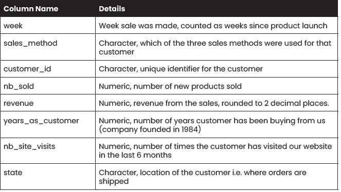

# Introduction

The company has launched new products a few weeks ago and decided to utilize three different sales strategies, to gather data and, hopefully, find out which strategy yields a better result. The strategies are:
- Email: Customers in this group received an email when the product line was launched, and a further email three weeks later. This required very little work for the team.
- Call: Customers were called by a member of the sales team. On average, members of the team were on the phone for around 30 mins per customer.
- Email and call: Customers were first sent the product information email, then called a week later to talk about their needs and questions. The email required little work, and the call was on average 10 mins per customer.

The sales manager has asked your department to analyze the data, gather insights and issue recommendations regarding the performance of the three strategies.  Your analytics supervisor will be out of office for a while and has tasked you with conducting the analysis and writing a report to him with your findings. You are free to make any necessary assumptions and revise them later when he arrives.

They've sent you this table describing the data, so you can properly validate.

# Data Validation and Cleaning

The dataset contains **15,000 rows and 8 columns** before cleaning and validation. The validation of the data was done by columns, based on the data information provided, as follows:

- week column: there are no missing values. All values fall within the accepted range of 0 - 6 weeks since product launch. No cleaning is needed.
- sales_method column: there are no missing values. A few entries were found to be different than the 'Email', 'Call', and 'Email + Call' sale methods. Upon inspection, those entries were found to be valid pieces of data, just in a different format, such as 'em + call' instead of 'Email + Call'. All divergent values were replaced to adhere to their corresponding format.
- customer_id: there are no missing values. It was noticed that the IDs followed the UUID or Universally Unique Identifier format, which is 36 characters long, with hyphens in positions 8, 13, 18, and 23. All observations were validated to correctly follow this format.
- nb_sold: there are no missing values. The range of the values is between 7-16, which seems reasonable and will be considered valid. No further action is required.
- revenue: there are **1,074 null values**. The range of the other values is 32.54 - 238.32 which will again be considered valid. The missing values constitute 7.16% of the total observations. This is far too small to consider dropping the column, but a little too high to comfortably drop the rows as well. To avoid the risk of introducing bias by eliminating information, the decision was made to impute the null values. Upon further inspection it was found that revenue appears dependant on the sales method utilized, and so **the missing values were replaced by the median** of the revenue corresponding to the sales method utilized. The median was chosen against the mean because the revenues did not follow a normal distribution. This, however, does not represent a problem and is expected because the revenue numbers depend on what type of product was sold. In fact, it was noticed in the distributions for the sales methods that there were most likely four different types of products sold.
- years_as_customer: there are no missing values. Two entires were found out of the range of 0-39 years, the upper limit being the years of operation of the company. The observations reported 47 and 63 years as customer. Since there were only two of them, it was decided to drop the rows in the cleaning process.
- nb_site_visits: there are no missing values. The range is between 12 - 41 which will be considered appropriate.
- state column: there are no missing values. All entries were checked against a list of strings for all US states and were found to be valid.

After the validation and cleaning process, the dataset contains **14,998 rows and 8 columns.** All values in the sales_method column now adhere to the same format and all missing values in the revenue column were replaced by a suitable group statistic.

# Exploratory Data Analysis

### What is the distribution of the revenue?

The most common revenues are between 90 and 110 USD worth of product being sold per customer. However, it is noticeable that there are three clumps of data in the distribution. This three clumps represent the three different sales approaches, which, luckily for us and our analysis, seem to have a big impact on the revenue.
Let's now visualize the spread, segmented by sales method.

The separation between the three categories is now much more visible. We can now see that the approach bringing in the most revenue is 'Email + Call'. You can also note the phenomena discussed in the data validation section of further clumps or groups of data within the three categories. This is most likely due to the different products being sold. We can distinguish four groups in each category, but still the ones reaching the highest revenue being all of the groups in the 'Email + Call' category. Only the highest grossing group of the 'Email' category starts to reach the same level of revenue as the 'Email + Call' group; nevertheless, with very few instances.

Now let's use a bar chart to visually compare the differences in mean revenue for each sales method.

The difference is quite significant. The mean revenue for the leading sales method is around 75% higher than the second place, 'Email'.

As increasing revenue is the main business goal, the best strategy would be to focus on the 'Email + Call' sales approach. **Let's continue to explore the data to find more useful insights.**

### How many customers were there for each approach?

Interesting! the method that brought in the highest revenue is also the one with the fewest customers who bought. If we now calculate a sum of all the revenue by sales method, instead of the average, we get that the 'Email' method grossed 672,318 USD, 'Email + Call' 408,257 USD, and 'Call' 227,563 USD, rounded to the nearest integer.

Since some methods are more time-intensive than others, I am including in my assumptions of the data that the groups are not equally sized. I will assume that the 'Email' group was the largest since it is significantly easier to only send emails en masse than to personally call the prospects, and thus the number of customers was much higher. **If this is not the case it is of utmost importance** that I am notified so as to modify the report's conclusions.

### Was there a difference in revenue over time?

Revenue increases over time across all sales methods. The line with the steepest ascent is the one from 'Email + Call', suggesting that not only did it accrue the highest average revenue by number of sales, but also that **the gap might grow to be even larger** if the experiment is kept running more weeks.

### Other variables?

Finally, let's take a quick look at the other variables and see what impact and relationships they might have.

It may be the case that older clients are more likely to buy with just an email approach, given that they already trust and know the company. In other words, will the amount of time the client's have been loyal to us have an effect on which sales method they respond better to? Below is a table of the average years the customers who bought the new products have been with us, grouped by the approach utilized for the sell:

| sales_method   | Avg    |
| ---------------| ------ |
| Call           | 5.168  |
| Email          | 4.976  |
| Email + Call   | 4.507  |

The differences are too small to warrant a statistical test to discard the relationship. **Neither newer nor older customers have a special inclination to a particular sales approach.** Although it may be noted that most of our customers are relatively new.

### Do clients who visit the site more often end up spending more money? 
Below is a scatterplot exploring this idea:

It seems there is an overall slight positive ascent on the data. Additionally, we can visualize that the inclination becomes more pronounced for the 'Email + Call' group. 

Having made sure via observation that the relationship is linear (versus quadratic, for example), a Pearson correlation test was conducted to quantify exactly how much one variable relates to the other. The correlation coefficient between site visits and revenue was **0.322**.

A second test was performed on only the customers approached by the 'Email + Call' method and, as anticipated, the correlation was higher with a value of **0.44**, well within the range of a moderate strength.

**This suggests that the more frequently a customer visits our site, the more money they end up spending, and this relationship is stronger within the 'Email + Call' **group.****

### Around how many products are customers buying?

To answer this question, let's use a boxplot to look at a distribution of the numbers of products sold.

The graph is lightly skewed to the right, meaning that values above the median tend to be higher than those below it, thus causing the mean to be higher than the median as well. Because of this,the median,here depicted, more aptly represents the central tendency of the data. In conclusion, we can say **our customers are buying around 10 products.**

# Business Metric

Considering the assumption that an unequal number of prospects were assigned to each group, and thus the number of sales made within each group is insignificant, **the business metric we should track is the average revenue grossed in the sales.** 

Currently, the mean revenues by sales method are:

| Method         | Mean revenue |
| ---------------| ------ |
| Call           | 48     |
| Email          | 97     |
| Email + Call   | 184    |

# Recommendations
- As the purpose of the experiment was to evaluate which of the three selling strategies worked better, **the main recommendation is to employ most resources, and focus mainly on the 'Email + Call' strategy.** This was the strategy with both the highest average revenue, our business metric, and a more rapid growth of average revenue as weeks since product launch elapsed.
- Keeping in mind that the method with the highest number of customers was 'Email', a second recommendation is to **keep utilizing the Email-only strategy with a secondary focus,** as it demands the least resources, and we can thus reach a higher number of prospects. So, the hybrid strategy would be to reach as many prospects as possible with the 'Email + Call' method, and only once the staff is saturated in work with this, to reach the rest of the prospects with the 'Email' method. 
- I also recommend **dropping the 'Call' strategy entirely,** as this is the strategy that performed the weakest on our business metric and it is also the strategy that demands the most time and resources, with calls lasting up to three times longer than in the 'Email + Call' method (30 vs 10 minutes long).
- Another recommendation is to **improve the UX/UI design of the web site;** indeed, the more frequently a client visited the web site, the more money they ended up spending. An improved design with a conversion focus might lead to more sales or even higher revenue per sale.
- Finally, I recommend **collecting the information on the type of product being sold and the number of customers being reached per each method.** This would help to conduct further analyses in the future and obtain new insights. 
  
